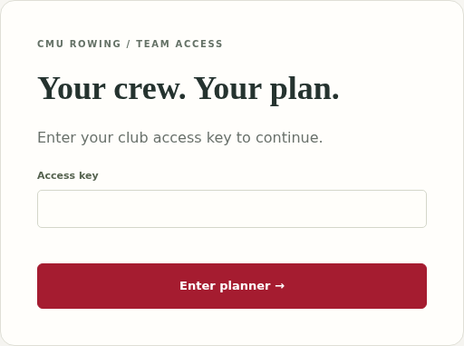
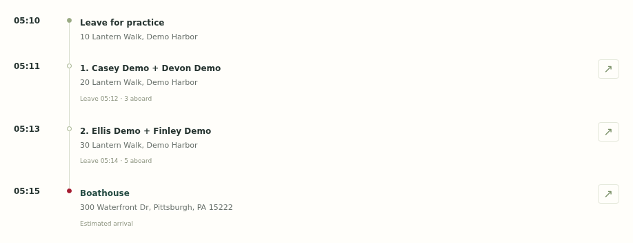
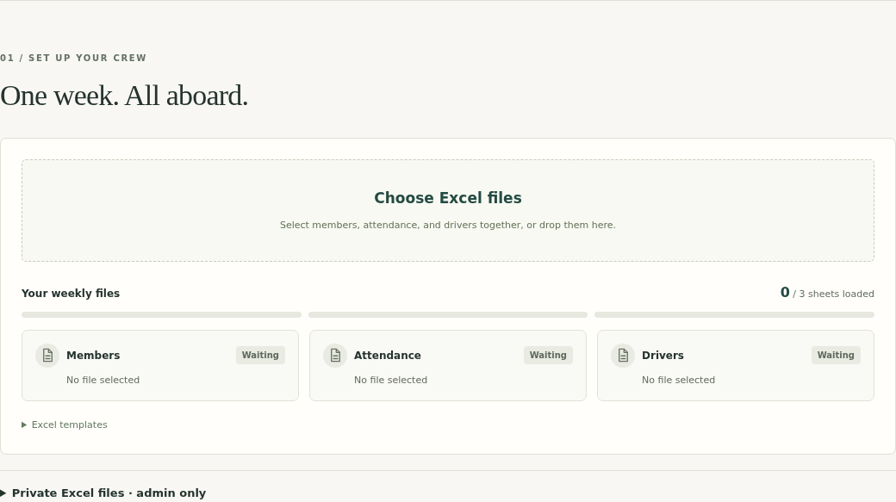
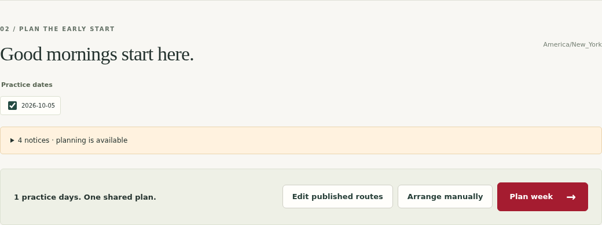
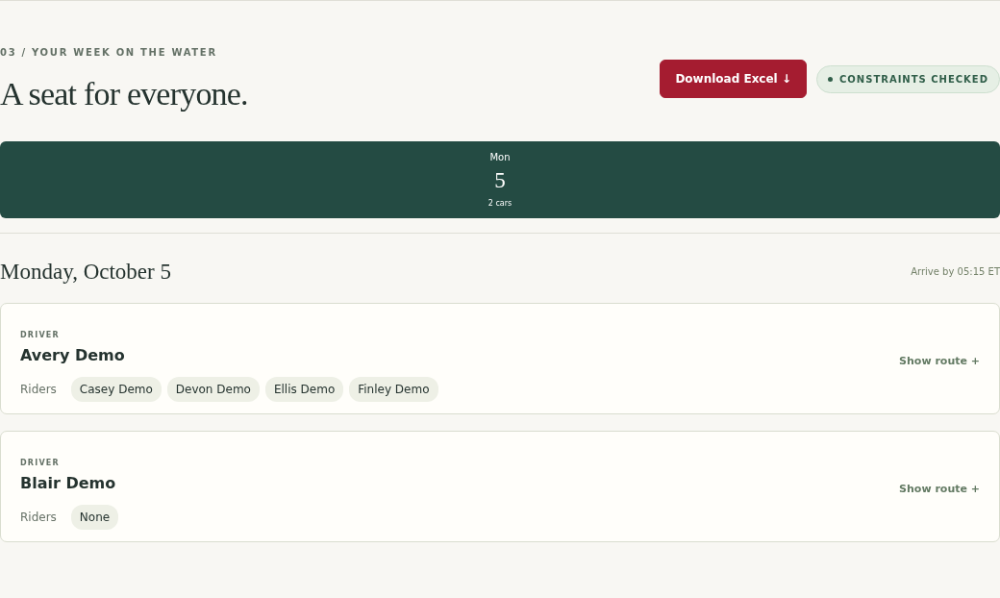

# CMU Rowing Carpool — Quick guide

Open **https://cmu-rowing.pages.dev/** on your phone or computer.
Ask your rowing organiser for an access key. Use the team key to view your ride, or the admin key to organise rides.

## Find your ride

1. Enter your **Access key** and select **Enter planner**.
2. Choose your practice date and find your name in a car.
3. Select **Show route** to see pickup places and times.
4. Select **Open in Google Maps** if you need directions.

Check the pickup time and place before leaving. Contact your organiser if your ride is missing or the details are wrong.

## Organiser: fill in three Excel files

Use the empty templates, or make a copy of the Week 3 examples.

| File                | What to enter                                      |
| ------------------- | -------------------------------------------------- |
| **members.xlsx**    | Each person's name and full pickup address.        |
| **attendance.xlsx** | Yes if they are attending; No if they are not.     |
| **drivers.xlsx**    | Yes if they can drive that day; No if they cannot. |

Use the same name spelling in all three files. In Attendance and Drivers, put dates across the top as **YYYY-MM-DD**, for example **2026-10-20**. Use the same dates in both files. Keep the sheet names **Members**, **Attendance**, and **Drivers**. Save each file as **Excel (.xlsx)**.

Empty answers count as No. A driver marked Yes is assumed to have five seats, including their own seat. You can adjust the seats later.

**Using Week 3?** Its dates are October 20–24, 2026. Confirm the dates, addresses, attendance and drivers before using it.

If you fill in the files in Google Sheets, use **File → Download → Microsoft Excel (.xlsx)** for each of the three files.

## Organiser: upload and plan

1. Sign in with your **admin key**.
2. Select **Choose Excel files**. Choose all three files together.
3. If the website asks you to correct something, fix it in Excel and upload the corrected file.
4. Check the destination and **Arrival deadline**. All times are Eastern Time.
5. Select the practice dates, then select **Plan week**. Wait for the car arrangements to appear.

## Organiser: check and share

1. Check each practice date: the drivers, passengers, pickup places and times.
2. Select **Show route** to see a car's pickup order.
3. When everything is correct, select **Publish to team**. Everyone with the team key can now see the plan.
4. Select **Download Excel** if you want a copy of the arrangements.

Need a change? Select **Edit routes**, adjust the arrangement, then select **Generate updated plan**. Check it again and select **Update published plan** to share the change.

Coming back later? Open **Private Excel files · admin only**, select **Load saved files**, then select **Edit published routes**.

## Need help?

- **Someone is missing:** check their Attendance answer and name spelling.
- **A pickup is wrong:** correct the address and make a new plan.
- **You changed an Excel file:** upload it again, plan again, and publish the updated plan.
- **The website cannot make a route:** check the address and your internet connection, then retry.
- **An Uber trip appears:** arrange and book that ride separately. The website does not book it.

Screenshots show example people and arrangements. Your dates and rides will be different.
